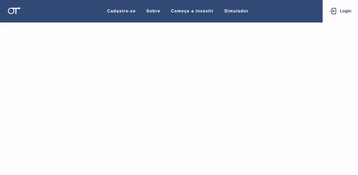

**[Em construção]**

# Oliveira Trade

Essa aplicação foi criada com [Create React App](https://github.com/facebook/create-react-app).

## Objetivos da Aplicação

Foi solicitado pelo board da empresa que seja desenvolvido uma forma de Sign in e Sign up de usuários. Devemos permitir que seja criado um usuário no sistema, com os campos mínimos de cadastro normal para Pessoa Física. O usuário deve ser notificado que o cadastro foi concluído com sucesso e, a partir deste ponto, ser possível executar login.

### Printscreen

### Tecnologias Usadas
Um pouco das tecnologias usadas até o momento.

* HTML5
* CSS3
* Javascript
* ReactJs
* React Router Dom
* StyledComponents
